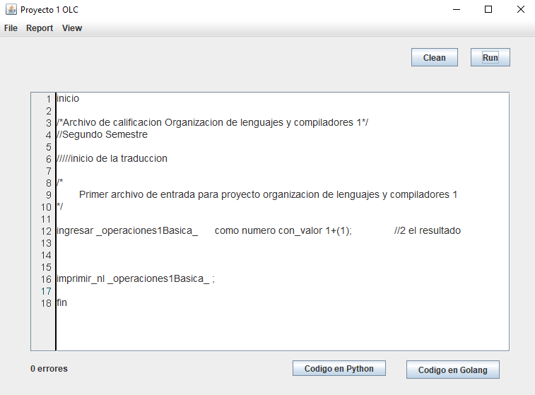
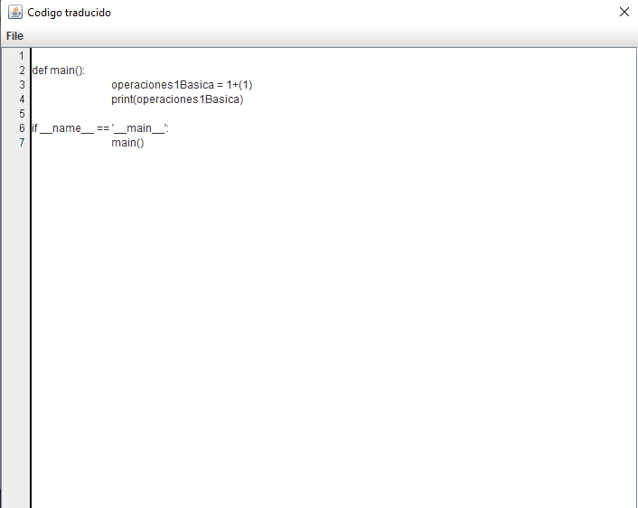
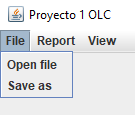
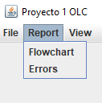
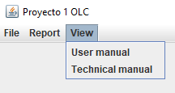

# Traductor de pseudocodigo

## Interfaz

Interfaz del traductor de pseudocodigo a python y golang

### Vista general

### Ejemplo de codigo

Se declara la variable `_operaciones1Basica_` de tipo entero y con valor `1+(1)`, luego se imprime dicha variable.

**Codigo traducido**:

### Menú Archivo

### Menú Reporte

- **Flowchart**: Genera el diagrama de flujo
- **Errors**: Genera la tabla de errores

### Menú View

Muestra el manual tecnico y de usuario.

> **NOTA:**
> Los reportes que se generan están disponibles en la raiz del proyecto dentro de la carpeta de `reports`
